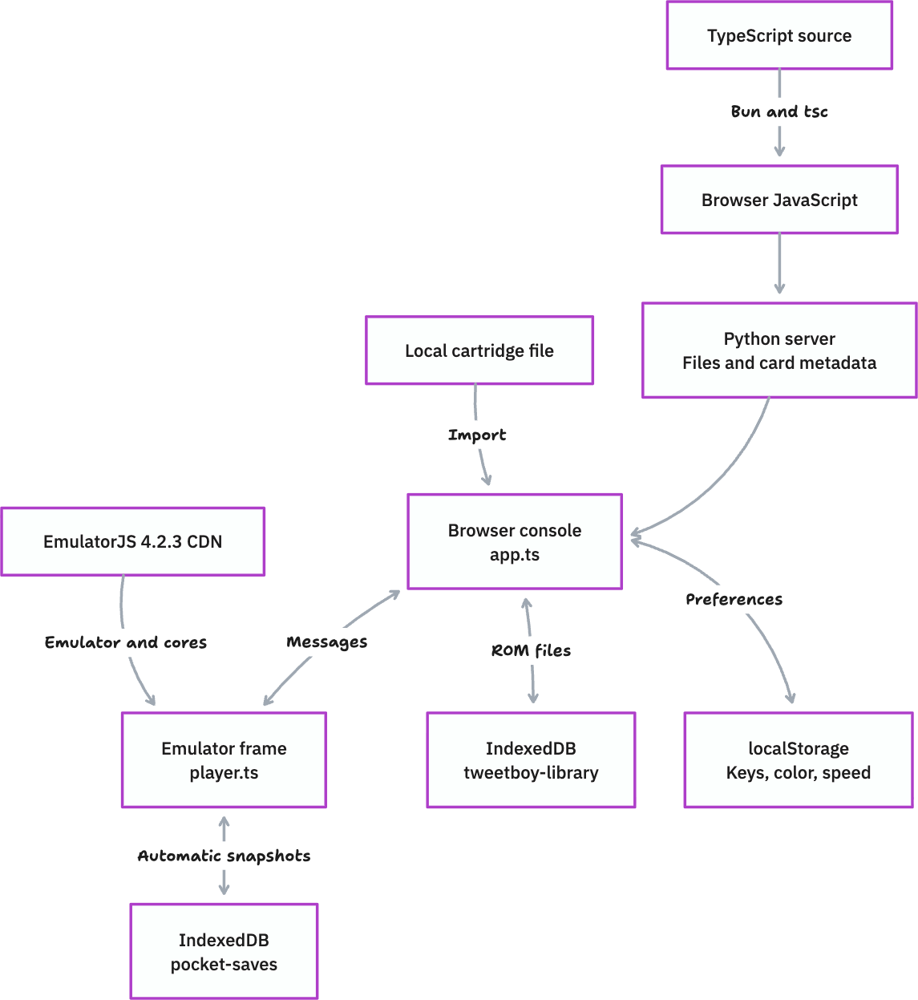

# Tweetboy

Tweetboy plays Game Boy, Game Boy Color, and Game Boy Advance cartridges in a browser. The interface supports touch controls and a keyboard.

The Python server supplies files and generates Player Card metadata. The browser runs the emulator and stores cartridges, settings, and saves. No games are preloaded.

## Project structure

| Path | Purpose |
| --- | --- |
| `src/app.ts` | Console interface, cartridge library, input, settings, and page lifecycle |
| `src/player.ts` | Emulator setup, game speed, automatic saves, and frame messages |
| `src/types.ts` | Cartridge, save snapshot, and message types |
| `src/globals.d.ts` | EmulatorJS and browser compatibility declarations |
| `public/index.html` | Console shell and menus |
| `public/player.html` | Page for the emulator frame |
| `public/style.css` | Console and menu styles |
| `public/app.js`, `public/player.js`, `public/types.js` | JavaScript generated from TypeScript |
| `public/assets/delta/` | Controller images |
| `public/preview.png`, `public/preview.svg` | Player Card artwork |
| `public/embed-preview.html` | Preview of the player at different sizes |
| `server.py` | HTTP server, card metadata, and frame policy |
| `tsconfig.json` | TypeScript compiler settings |
| `bun.lock` | Exact build dependency versions |
| `docs/architecture.png` | Architecture diagram exported from tldraw |
| `docs/architecture.tldraw.json` | Editable tldraw document snapshot |
| `tests/test_server.py` | HTTP integration tests |
| `tools/build-release.py` | Build output, source archive, and release directory |
| `tools/delta-skin/` | Controller source artwork and rendering script |
| `tools/render-preview.py` | Preview image generator |

## How the player works



[Edit the diagram in tldraw](https://www.tldraw.com/f/jCtQhTKrypnwLxWObfP-S). The document snapshot is saved in `docs/architecture.tldraw.json`.

1. The server returns the console page.
2. `app.ts` reads the local cartridge library and settings.
3. If a saved cartridge exists, the console loads it. Otherwise, it shows **Choose a cartridge**.
4. The user selects a `.gb`, `.gbc`, or `.gba` file of up to 32 MiB.
5. The console checks the cartridge header and calculates its SHA-256 hash.
6. The browser stores the cartridge in IndexedDB and creates a local Blob URL.
7. The console opens `player.html` in an iframe and sends the cartridge URL to it.
8. `player.ts` starts EmulatorJS and restores the latest save snapshot.

EmulatorJS 4.2.3 loads from `https://cdn.emulatorjs.org/4.2.3/data/`. Gambatte runs Game Boy and Game Boy Color games. mGBA runs Game Boy Advance games. The emulator requires internet access to load these files.

The console and emulator communicate through `postMessage`. Both pages check the message origin and sender. Input messages carry button presses. Other messages control sound, pause, reset, speed, and save operations.

The player uses a fixed 59.7275 Hz frame schedule at normal speed. This prevents faster displays from increasing the game speed.

## Input and settings

| Action | Default keys |
| --- | --- |
| Move | W / A / S / D |
| B / A | J / K |
| L / R | R / U |
| Select / Start | 1 / 2 |
| Fast-forward | Shift |
| Sound | M |
| Pause / resume | P |
| Menu | Escape |

Keyboard input requires focus inside the player. Touch controls support diagonal movement and simultaneous button presses. When the game pauses, key labels appear over the console buttons.

The top cartridge slot opens the Game menu. **Settings** contains keyboard mappings, shell colors, and **Game speed**.

Game speed options are 1×, 1.5×, 2×, 3×, and 4×. Hold Shift for temporary fast-forward at a minimum of 3×. Release Shift to return to the selected speed. Higher speeds depend on device performance and can change sound.

Games start with sound off. Embedded players require the user to turn sound on in the menu. Outside an embed, console input also turns sound on.

## Browser storage

| Storage | Contents |
| --- | --- |
| IndexedDB `tweetboy-library` | Imported cartridge files and cartridge records, identified by SHA-256 hash |
| IndexedDB `pocket-saves` | Emulator snapshots under `autosave:<ROM hash>` |
| localStorage | Keyboard mappings, shell color, game speed, last cartridge, and keyboard guide status |
| EmulatorJS save storage | In-game battery saves |

The player saves a snapshot every 30 seconds during play. It also saves when the user pauses, changes cartridges, or hides the page. Loading the same cartridge restores its latest snapshot. An older manual snapshot is used if no automatic snapshot exists.

**Reset** removes the resume snapshot and restarts the cartridge. It keeps in-game save files.

Cartridges and saves stay in the browser. The server has no ROM upload endpoint or cloud save service. Storage belongs to the website origin: its protocol, host, and port. Embedded players may use separate browser storage.

Progress does not transfer between browsers, devices, or origins. Clearing site data removes stored cartridges and saves. Closing the browser can interrupt the final save. The last completed snapshot may be up to 30 seconds behind.

## Server routes and embeds

| Route | Purpose |
| --- | --- |
| `/` | Console and generic Player Card metadata |
| `/r/library` | Library share page |
| `/play/library` | Iframe player |
| `/embed-preview.html` | Player size preview |

Share pages include metadata in their initial HTML. The metadata supplies the card title, preview image, and player URL. It cannot read a visitor's browser saves. Each visitor imports a cartridge in their own browser.

```html
<iframe src="https://your-domain.example/play/library"
        width="600" height="600" style="border:0;border-radius:16px"
        allow="autoplay; fullscreen" allowfullscreen title="Tweetboy"></iframe>
```

`FRAME_POLICY` in `server.py` permits frames from Tweetboy, X, and Twitter. The policy also applies to the nested emulator frame. Add another origin to this policy if another site must embed the player.

Card metadata does not guarantee that X displays an interactive card. Audio permission still requires user interaction.

## Run and build

Use Python 3.11 or newer and Bun 1.3.5 or newer.

```sh
bun install --frozen-lockfile
bun run start
```

Open [localhost:8765](http://127.0.0.1:8765/). `bun run start` compiles TypeScript and starts the Python server.

Edit files in `src/`. Run `bun run build` to generate JavaScript in `public/`. Do not edit the generated JavaScript directly. Generated files are committed so the Docker image can run without Bun.

The compiler does not generate output when type checks fail. Full strict mode is not enabled.

The player requires localhost or HTTPS. Direct HTML files and plain HTTP on a phone's LAN address do not supply the required secure context.

## Server configuration

The shell or hosting environment supplies these variables. The server does not load `.env` files automatically.

| Variable | Default | Purpose |
| --- | --- | --- |
| `PUBLIC_URL` | `http://127.0.0.1:8765` | Origin for card assets and canonical URLs |
| `TWITTER_SITE` | Unset | Optional publisher handle |
| `BIND_HOST` | `127.0.0.1` | Server address; use `0.0.0.0` in a container |
| `PORT` | `8765` | Server port |

`PUBLIC_URL` must be an HTTPS origin without a path, query, fragment, or credentials. HTTP is permitted only for localhost. If you change `PORT`, set `PUBLIC_URL` to match.

The server blocks dotfiles, directory listings, and links outside `public/`. The Dockerfile uses Python 3.12 and serves the generated files. There is no offline cache.

## Checks and release files

```sh
bun run test
python3 tools/build-release.py
```

`bun run test` checks TypeScript and runs seven HTTP integration tests. The tests use a temporary directory and require no ROMs or external services.

The release builder compiles TypeScript, updates `public/licenses/tweetboy-source.zip`, and creates `work/release/`. The source archive includes the TypeScript files and build configuration. The release directory contains the server, Docker configuration, and browser files. It excludes ROMs and common credential files.

For browser checks, use `/embed-preview.html`. Check cartridge import, input, sound, pause, speed, saved progress, and saved settings.
